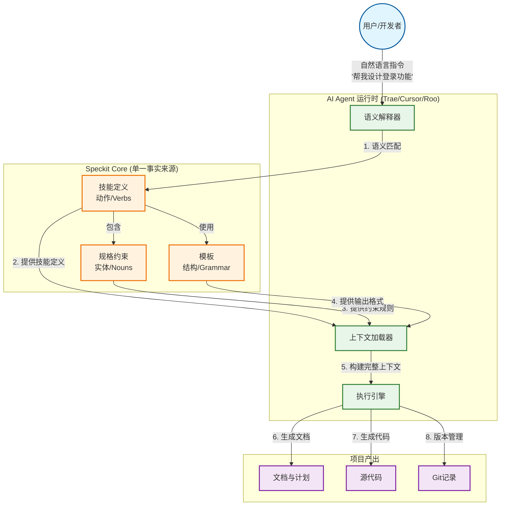
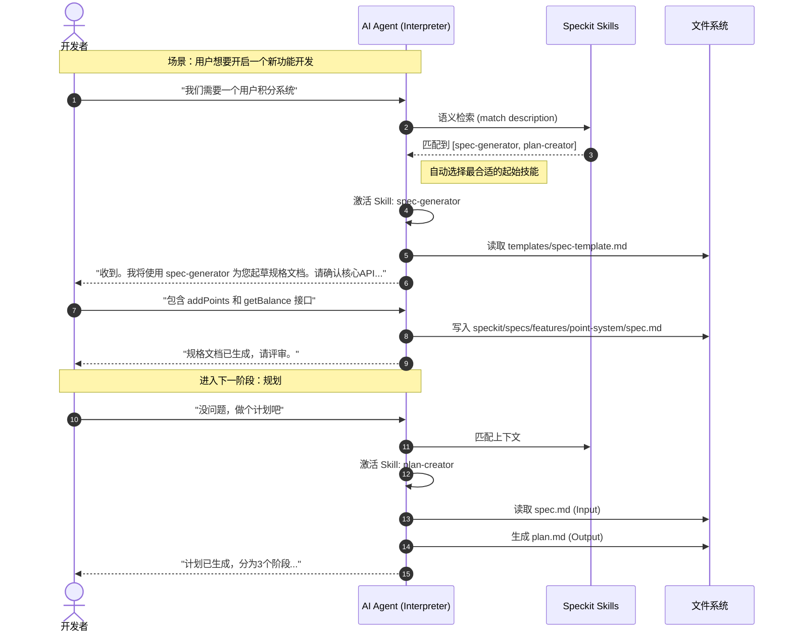
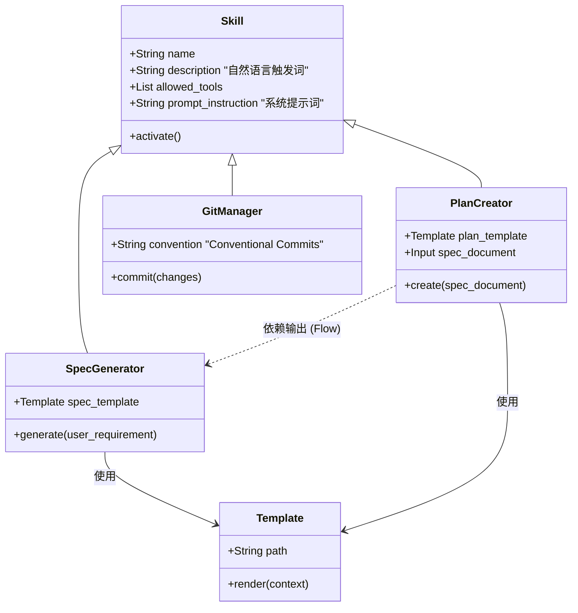
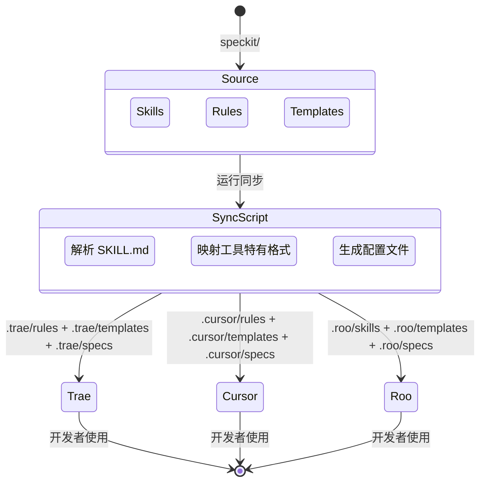

# 面向 AI Coding 的项目规范脚手架架构文档

> **核心理念**：自然语言即代码 (Natural Language as Code)。本架构旨在将复杂的软件工程规范封装为 AI 可理解的"技能"，让开发者通过自然语言对话即可驱动标准的研发流程。

## 1. 架构总览：自然语言驱动开发 (NLDD)

本脚手架构建了一个**自然语言接口层 (Natural Language Interface Layer)**，位于开发者与底层工具链（Git, 文件系统, 编译器）之间。AI Agent 充当解释器，将用户的模糊意图（Intents）转化为精确的工程操作。

### 1.1 系统上下文视图 (System Context View)

下图展示了开发者如何通过自然语言与系统交互，以及系统如何利用单一事实来源 (Single Source of Truth) 来响应请求。

### 1.2 面向 AI Coding 的系统边界与职责分层

本脚手架的目标不是“替代开发者”，而是把**研发规范**与**工程动作**结构化为可复用、可同步、可审计的资产，使 AI Agent 能稳定地产出符合团队规则的交付物。

#### 1.2.1 系统边界（什么在系统内 / 什么在系统外）

- **系统内（由脚手架负责）**：
  - **规范资产治理**：`speckit/` 作为单一事实来源（技能、模板、规格、宪章/目录规范）。
  - **运行时编排**：AI Agent 根据自然语言意图匹配技能，加载约束与模板，生成输出。
  - **跨 IDE 配置分发**：通过 `scripts/sync-skills.ps1` 将 `speckit/` 同步到 `.cursor/`、`.roo/`、`.trae/` 等产物目录（产物目录禁止手改）。
- **系统外（由宿主环境或团队流程负责）**：
  - **代码执行与构建**：编译、测试、运行环境（由项目自身工具链负责）。
  - **权限与安全策略**：访问令牌、密钥、仓库权限（由组织安全体系负责）。
  - **最终决策**：需求取舍、合并主干审批（由开发者/评审流程负责）。

#### 1.2.2 关键输入与输出（以“可审计交付”为中心）

- **输入（Inputs）**：
  - 自然语言意图（需求/变更/排障/评审）
  - 项目上下文（代码、已有文档、历史变更）
  - 规范约束（宪章、目录结构、错误处理与日志规范等）
  - 输出模板（Plan/Spec/Change/Debug 等）
- **输出（Outputs）**：
  - **可追溯文档**：`docs/`、`speckit/specs/`、`speckit/templates/` 的新增/更新
  - **可审计代码变更**：`src/` 内的实现与配套单元测试
  - **可回溯历史**：Git 变更记录（提交信息、变更说明）

#### 1.2.3 “规范注入”的核心价值

与“通用 AI 编程”相比，本脚手架强调把团队规则变成可执行约束：

- **规则变成默认行为**：目录规范、文档命名、错误处理、日志结构、禁止模式等，在生成与修改时自动生效。
- **输出变得可预测**：模板确保产出结构一致，便于评审、搜索、复用与自动化处理。
- **扩展点清晰**：新增能力优先通过新增 Skill/Template/Spec 扩展，而不是在运行时硬编码分支逻辑。

## 2. 核心机制：从意图到交付

本架构通过三个关键抽象实现自然语言驱动：**Skills (技能)**、**Pathways (路径)** 和 **Sync (同步)**。

### 2.1 交互序列图 (Sequence Diagram)

以下序列图展示了一个典型的 "Spec-First" 开发会话，演示系统如何引导用户完成任务。

### 2.2 技能类图 (Class Diagram)

展示了 `Speckit` 如何通过面向对象的方式组织自然语言能力。

### 2.3 运行时约束与“安全闸门”（让 AI 可控、可审计）

当 AI Agent 能写代码、改配置、甚至删除文件时，“默认放行”会带来不可控风险。本脚手架用**宪章（constitution）+ 规则（rules）+ 技能边界（allowed-tools）** 形成运行时约束，使行为可预测、可追踪、可复盘。

#### 2.3.1 约束类型（从软提示到硬约束）

- **输出结构约束（模板）**：例如 Spec/Plan/Change/Debug 文档固定栏目，避免信息缺失。
- **工程规则约束（宪章/目录结构）**：例如文档中文命名、目录落位、禁止 TODO/FIXME、禁止硬编码配置值等。
- **权限约束（allowed-tools）**：技能声明可用工具集，避免“无意中越权”。
- **确认闸门（人类在环）**：例如“删除/重写代码、修改配置文件、添加新依赖”需要用户确认后才执行。

#### 2.3.2 可审计性（为什么能回溯）

- **单一事实来源**：`speckit/` 集中存放规则、模板、技能定义，便于审计与评审。
- **可追溯工件**：关键交付物落在 `docs/`、`speckit/specs/`、`src/`，并能通过 Git 历史回溯“何时、为何、由谁（或哪个技能）引入”。

## 3. 目录结构与职责

为了支持上述架构，项目采用以下标准目录结构：

| 目录 | 角色 | 说明 | 自然语言映射 |
|------|------|------|--------------|
| `speckit/skills/` | **能力中心** | 定义 AI 能**做**什么 | 包含触发关键词 (Keywords) |
| `speckit/specs/` | **记忆中心** | 存储项目**是**什么 | 提供上下文 (Context) |
| `speckit/templates/` | **规范中心** | 约束输出**像**什么 | 提供格式范例 (Format) |
| `scripts/` | **分发中心** | 确保多端**一致** | 编译配置 (Compiler) |
| `.cursor/` / `.roo/` / `.trae/` | **同步产物** | 面向具体工具的配置输出（禁止手改） | “运行环境适配层” |

### 3.0 目录治理要点（与宪章/目录规范对齐）

- **事实来源与产物分离**：`speckit/` 是主源；`.cursor/`、`.roo/`、`.trae/` 是同步产物，只能由同步脚本生成。
- **工件落位优先**：文档进入 `docs/`（中文命名），代码进入 `src/`（英文 kebab-case），规范进入 `speckit/`。
- **目录自描述**：每个目录维护 `00-目录说明.md`，记录文件用途与更新时间戳。

### 3.1 同步机制 (The Sync Engine)

由于不同的 AI IDE (Trae, Cursor, Roo) 配置格式不同，我们使用 `scripts/sync-skills.ps1` 作为**配置编译器**：

## 4. 开发者指南

### 4.1 如何"说话" (Prompting Strategy)

在 NLDD 模式下，您的 Prompt 应该更像是在**委派任务**而不是**编写代码**。

*   **❌ 传统模式**：
    > "在 src/utils.ts 里写一个函数，输入 string 返回 boolean..."
*   **✅ NLDD 模式**：
    > "使用 **spec-generator** 为工具类库添加一个输入验证功能。"
    > *(系统会自动找到模板、创建文件、应用规范)*

*   **❌ 传统模式**：
    > "git add . 然后 git commit -m 'fix bug'..."
*   **✅ NLDD 模式**：
    > "帮我提交代码。"
    > *(系统会自动分析变更、生成符合 Conventional Commits 的消息)*

### 4.2 扩展架构

如果您需要让 AI 学会新的流程（例如：自动写 SQL 迁移脚本）：

1.  在 `speckit/skills/` 下新建 `sql-migrator` 目录。
2.  编写 `SKILL.md`，定义它的 `description`（如 "database, migration, sql"）。
3.  放入 `templates/migration.sql` 模板。
4.  运行 `sync-skills`。
5.  **即刻生效**：您现在可以对 AI 说 "帮我生成一个用户表迁移脚本"。

### 4.3 推荐的对话方式（把“说清楚”变成“做正确”）

- **把目标说成“交付物”**：例如“生成规格文档/生成计划/做变更说明/补单元测试”，比“写一段代码”更稳定。
- **显式给出边界与约束**：例如“不要新增依赖”“只改 2 个文件以内”“需要兼容旧接口”等，可减少往返与误改。
- **让 AI 汇报决策点**：当出现删除/重写、改配置、加依赖等高风险动作，要求先解释影响范围并等待确认。

---
*文档版本：1.1 | 最后更新：2026-01-15*
