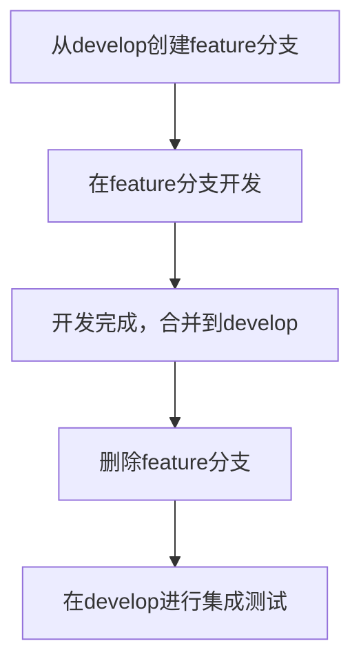
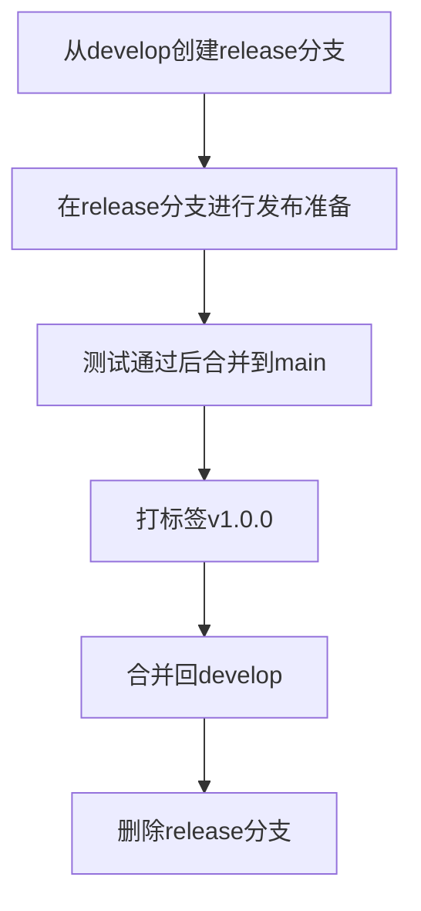
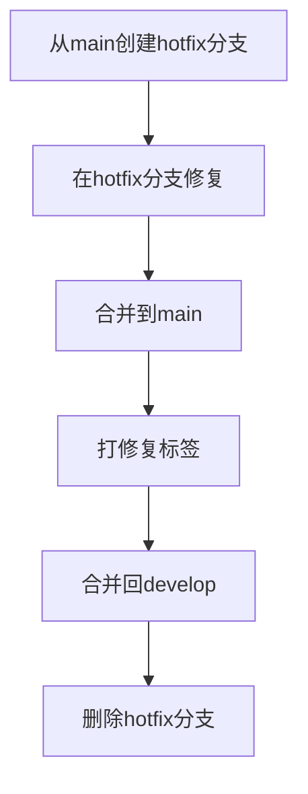

# lumoscribe2026 Git仓库建设方案

## 项目概述

**项目名称：** lumoscribe2026  
**项目定位：** AI coding全生命周期管理能力平台  
**当前阶段：** 项目初期，正在搭建AI agent skills和templates  
**仓库位置：** f:/lumoscribe2026  

## 1. Git分支策略设计

### 1.1 分支模型选择：Git Flow

基于项目特点（AI coding平台、多技能模块、需要版本管理），推荐使用 **Git Flow** 分支策略：

```
main/master     ────── 生产环境代码（稳定版本）
│
├── develop      ────── 开发集成分支（最新开发版本）
│   │
│   ├── feature/*   ── 新功能分支（如：feature/skill-generator）
│   ├── release/*   ── 发布准备分支（如：release/v1.0.0）
│   └── hotfix/*    ── 紧急修复分支（如：hotfix/bug-fix-20260112）
```

### 1.2 分支命名规范

| 分支类型 | 命名格式 | 示例 | 说明 |
|---------|---------|------|------|
| 主分支 | `main` | `main` | 生产环境代码 |
| 开发分支 | `develop` | `develop` | 集成开发版本 |
| 功能分支 | `feature/[模块]-[功能]` | `feature/skill-generator` | 新功能开发 |
| 发布分支 | `release/v[版本号]` | `release/v1.0.0` | 版本发布准备 |
| 修复分支 | `hotfix/[问题描述]` | `hotfix/bug-fix-20260112` | 紧急修复 |

### 1.3 工作流程

#### 功能开发流程


#### 版本发布流程


#### 紧急修复流程


## 2. 提交信息规范

### 2.1 格式：Conventional Commits

```
<type>(<scope>): <description>

[optional body]

[optional footer]
```

### 2.2 提交类型定义

| 类型 | 说明 | 示例 |
|-----|------|------|
| `feat` | 新功能 | `feat(skill-generator): add template generation` |
| `fix` | 修复bug | `fix(debug-diagnostic): resolve template parsing error` |
| `docs` | 文档更新 | `docs: update git strategy documentation` |
| `style` | 代码格式 | `style: format code according to eslint rules` |
| `refactor` | 重构 | `refactor: improve skill module architecture` |
| `test` | 测试相关 | `test: add unit tests for plan creator` |
| `chore` | 构建或辅助工具 | `chore: update dependencies` |

### 2.3 Scope范围定义

| Scope | 说明 | 示例 |
|-------|------|------|
| `skill-generator` | 技能生成器模块 | `feat(skill-generator): add new template` |
| `plan-creator` | 计划创建器模块 | `fix(plan-creator): resolve validation error` |
| `task-breakdown` | 任务分解模块 | `refactor(task-breakdown): improve algorithm` |
| `change-manager` | 变更管理模块 | `docs(change-manager): update usage guide` |
| `debug-diagnostic` | 调试诊断模块 | `test(debug-diagnostic): add integration tests` |
| `templates` | 模板相关 | `chore(templates): update template structure` |
| `config` | 配置相关 | `feat(config): add git hooks configuration` |

## 3. Git配置文件

### 3.1 .gitignore 文件

```gitignore
# AI相关
*.model
*.checkpoint
*.log
.cache/
models/
datasets/

# 开发环境
node_modules/
.env
.env.local
.env.development.local
.env.test.local
.env.production.local

# 构建产物
dist/
build/
out/
coverage/

# IDE配置
.vscode/
.idea/
*.swp
*.swo

# 系统文件
.DS_Store
Thumbs.db
*.tmp

# 临时文件
*.tmp
*.temp
*.log
```

### 3.2 .gitattributes 文件

```gitattributes
# 设置换行符处理
*.md text eol=lf
*.json text eol=lf
*.js text eol=lf
*.ts text eol=lf
*.py text eol=lf

# 二进制文件
*.png binary
*.jpg binary
*.jpeg binary
*.gif binary
*.ico binary
*.pdf binary

# 配置文件
*.gitignore text eol=lf
*.gitattributes text eol=lf
```

## 4. CI/CD集成方案

### 4.1 基础CI流程

```yaml
# .github/workflows/ci.yml
name: CI

on:
  push:
    branches: [ main, develop ]
  pull_request:
    branches: [ main, develop ]

jobs:
  test:
    runs-on: ubuntu-latest
    steps:
      - uses: actions/checkout@v3
      - name: Setup Node.js
        uses: actions/setup-node@v3
        with:
          node-version: '18'
      - run: npm install
      - run: npm test
      - run: npm run lint
```

### 4.2 代码质量检查

- **ESLint** - 代码规范检查
- **Prettier** - 代码格式化
- **Husky** - Git hooks管理
- **Commitlint** - 提交信息规范检查

### 4.3 发布流程

```yaml
# .github/workflows/release.yml
name: Release

on:
  push:
    tags:
      - 'v*'

jobs:
  release:
    runs-on: ubuntu-latest
    steps:
      - uses: actions/checkout@v3
      - name: Setup Node.js
        uses: actions/setup-node@v3
        with:
          node-version: '18'
          registry-url: 'https://registry.npmjs.org'
      - run: npm install
      - run: npm run build
      - run: npm publish
        env:
          NODE_AUTH_TOKEN: ${{ secrets.NPM_TOKEN }}
```

## 5. 仓库保护规则

### 5.1 分支保护

- **main分支：**
  - 禁止直接推送
  - 要求Pull Request审查
  - 要求CI/CD检查通过
  - 需要至少1个代码所有者批准

- **develop分支：**
  - 要求Pull Request审查
  - 要求CI/CD检查通过

### 5.2 代码审查要求

- 所有功能开发必须通过Pull Request
- 至少1人代码审查
- CI/CD检查必须通过
- 提交信息必须符合规范

## 6. 实施计划

### 阶段一：基础设置（第1周）
- [ ] 初始化Git仓库
- [ ] 创建基础配置文件（.gitignore、.gitattributes）
- [ ] 设置用户信息
- [ ] 创建远程仓库并关联

### 阶段二：分支策略实施（第2周）
- [ ] 创建develop分支
- [ ] 建立分支保护规则
- [ ] 配置CI/CD基础流程
- [ ] 设置代码审查要求

### 阶段三：质量保证（第3周）
- [ ] 配置Git hooks
- [ ] 设置提交信息规范检查
- [ ] 配置代码质量检查工具
- [ ] 建立发布流程

### 阶段四：团队培训（第4周）
- [ ] 团队Git工作流程培训
- [ ] 分支策略说明文档
- [ ] 最佳实践指南
- [ ] 问题排查指南

## 7. 最佳实践

### 7.1 提交频率
- 小而频繁的提交
- 每个提交应该是一个完整的逻辑单元
- 避免大型提交

### 7.2 Pull Request规范
- PR标题清晰描述变更内容
- 详细描述变更原因和影响
- 关联相关issue或任务
- 提供测试说明

### 7.3 代码审查要点
- 代码逻辑正确性
- 是否符合项目规范
- 是否有潜在的性能问题
- 文档是否完整

## 8. 监控与改进

### 8.1 关键指标
- 提交频率和质量
- PR审查时间
- 构建成功率
- 发布频率

### 8.2 定期回顾
- 每月回顾Git工作流程
- 收集团队反馈
- 优化分支策略
- 更新最佳实践

---

**文档版本：** v1.0  
**创建日期：** 2026-01-12  
**最后更新：** 2026-01-12  
**负责人：** lumoscribe2026团队