# 证券研究报告

# 储能系列报告

# 从“配角"到“主角”， 储能前景广阔

证券分析师

李梦强 投资咨询资格编号：S1060525090001  
张之尧 投资咨询资格编号：S1060524070005

新型储能：从“配角”到“主角”，需求前景光明。新能源的快速发展对电力系统的调节能力和支撑能力提出挑战，要求电力系统形态由“源网荷”三要素向“源网荷储”四要素转变。储能登上舞台，成为构建新型电力系统的重要基础。我们认为，能源安全和双碳战略下，我国风光装机体量将持续增长；当前国内储能装机和充放电量与电力系统整体相比并不高，需求空间广阔。

、概念：存储电能的设备，电力系统的“蓄水池”。储能系统是用于电能转化和存储的装置。电的传输速度与光速相同，电力发、输、用在同一瞬间完成，要求系统实时平衡。风、光发电存在间歇性和波动性，供需难以实时匹配，高比例新能源接入会影响供电质量和用电效率。储能是电力系统中的“蓄水池”，可以动态吸收电能并适时释放，将实时平衡的“刚性”电力系统变得更加“柔性”，提高输出电能的稳定性、平滑用电负荷，从而提高供电质量和用电效率。因此，储能是推动可再生能源大规模应用的关键技术。

# . 二、逻辑：需求空间广阔，政策 $\cdot$ 市场驱动。

能源安全 $+ \infty$ 碳战略下，风光装机及占比将持续增长。截至2024年底，我国风光装机合计14亿千瓦，占电源装机量的 $42 \%$ ；2024年我国风光发电量占总发电量的 $1 8 \%$ ，远低于装机量占比。发展风光可再生能源是能源安全和双碳战略的内在需求。能源安全方面，我国三大化石能源储量可开采年数仅30-40年，且原油和天然气依赖进口，发展可再生能源的需求迫切；双碳战略方面，可再生能源替代是控制碳排放的重要途径。我国2025年9月宣布新一轮国家自主贡献目标，提出到2035年风光装机总量力争达到36亿千瓦。

新型储能渗透空间广阔，政策 $\cdot ^ { + }$ 市场驱动增长。截至2025年9月底，我国新型储能累计装机1亿千瓦以上，与“十三五”末相比增长超30倍，占全球总装机比例超过 $40 \%$ ，跃居世界第一。但与电力系统整体规模相比，储能渗透率并不高：我们计算（截至2025.9）新型储能功率与发电总装机/新能源装机之比分别为3%和6%；2024年国内电化学储能电站充放电总量约62TWh，占新能源发电量比例3.4%，占发电总量的比例仅0.6%。作为新型电力系统的重要基础，我们认为国内储能渗透率仍有增长空间；同时，考虑到2035年风光装机总量36亿千瓦的装机目标（2024年底的2.6倍），我们认为国内储能装机量级提升空间广阔。具体驱动因素来看，政策积极扶持、电力现货市场建设推进，独立储能经济性逐渐跑通，储能增长动力充足。

投资建议：风光装机总量和占比仍将持续增长，储能渗透率提升空间广阔。“十五五”规划建议提出“加快建设新型能源体系”“积极稳妥推进和实现碳达峰”目标，新型储能在新型电力系统中将扮演重要角色。我国是新型储能全球第一大市场，独立储能装机有望快速增长；与此同时，数据中心供电和电网平衡需求下，全球储能需求亦呈现高景气。推荐：海外大储领军者、全球市场竞争力强的阳光电源；国内大储市场地位领先、把握独立储能增长机遇的海博思创；海外市场拓展顺利、重视欧洲和中东新兴市场的上能电气。

风险提示：1.各市场需求增长不及预期的风险。2.全球市场竞争加剧的风险。3.市场限制政策收紧的风险。

# 储能行业研究框架

<table><tr><td colspan="2"></td><td>大储</td><td>户储</td><td>工商业储能</td></tr><tr><td rowspan="3"></td><td>市场分布</td><td>·中国、美国是大储主要市场；欧洲、中东市场 也逐渐起步</td><td>欧洲为户储主要市场；澳洲和亚非拉 市场亦迎来快速增长</td><td>我国、欧洲、新兴市场工商 业储能均呈现快速发展</td></tr><tr><td>驱动因素</td><td>本质上，大储装机需求来自于风电、光伏高比 例并网产生的灵活性资源需求 各国通过补贴政策+市场建设，推动大储商业 模式逐渐完善，装机不断增加</td><td>·购买方为家庭用户，经济性和保障用 电是主要需求 ·经济性：高电价+购售电价差下，户储 系统可节省用电成本 ）保障用电：在停电情形下保障用电</td><td>工商业用户有节省电费和保 障用电的需求 ，用户侧存在峰谷电价差，用 户可获取套利收益</td></tr><tr><td>重点市场</td><td>·中国、美国是全球大储装机主力。 ·欧洲、中东、澳洲大储市场有望快速增长。</td><td>欧洲是全球户储主要市场，装机体量 较大。 亚非拉新兴市场增长迅速；澳洲市场 潜力优良。</td><td>·我国是工商业储能装机的重 要市场。 欧洲、亚非拉工商储快速渗 透中。</td></tr><tr><td rowspan="3">供满</td><td>技术路线</td><td>抽水蓄能存量规模庞大，电化学（锂电池）储 能是主要增量，各种技术路线百花齐放</td><td>主要为锂电池储能，部分新兴市场采用 铅酸电池，锂电池逐步渗透</td><td>主要为锂电池储能，部分项 目采用铅炭、液流电池储能</td></tr><tr><td>产品形态</td><td>最终以大储电站形式运营。储能业主可对储能 系统/EPC进行招标，部分业主也通过集中采购 形式直接购买电芯和PCS，自行集成以控制成本。</td><td>安装于住宅中，类似家电，多搭配户用 光伏系统。面向客户的产品可以为储能 电池包+PCS，或两者集成的一体机</td><td>安装于厂房/园区，有机柜 （百kWh级）和集装箱 （MWh级）两种类型</td></tr><tr><td>产业链构成</td><td>上游核心设备：电池、PCS、温控与消防设备 ·中游：系统集成（PCS、电池厂商亦参与此环节） ·下游：电站运营</td><td>电芯：上游，销售给储能系统厂商 储能系统、PCS；通常销售给安装商 一体机：通常以自有渠道销售给用户</td><td>户储/大储系统企业布局工 商业储能机柜产品</td></tr></table>

资料来源：平安证券研究所整理

# 我国储能市场参与者全景图

# 储能电池

PCS

# 温控消防

# 储能系统 (集成)

参与者包括主流动力电池/消费电池企业，通常兼有大储和户储电池产品

储能系统和PCS参与者重合度较高，厂商自供PCS并销售系统。大小储参与者不同。

大储、工商业储能必需的设备环节，格局较好

# 大储、户储布局者繁多；户储企业积极拓展海外工商储市场

# 大储

# 储能电池

# 大储PCS

·阳光电源 南网科技 国电南瑞海博思创 南都电源 . 许继电气. 上能电气 . 四方股份 . 科陆电子·科华数据 + 金盘科技 . 新源智储·比亚迪 . 新风光 . 融和元储

# 户储

行 德业股份. 艾罗能源. 派能科技. 科士达固德威沃太能源. 华为

# 户储PCS

# 工商业储能

#

# 温控

·德业股份· 固德威. 锦浪科技. 禾迈股份昱能科技. 古瑞瓦特· 艾罗能源. 首航新能. 英维克· 高澜股份同飞股份. 奥特佳·德业股份· 艾罗能源· 苏文电能. 金冠股份. 奇点能源. 美克生能源. 兴储世纪

# 消防

·青鸟消防·国安达·阳光电源科华数据· 比亚迪. 上能电气. 盛弘股份. 国电南瑞. 禾望电气华为索英电气

·宁德时代·瑞浦兰钧鹏辉能源 蜂巢能源· 比亚迪 . 双登股份· 亿纬锂能 . 远景能源· 派能科技 . 海辰储能· 南都电源 . 天津力神· 国轩高科 . 昆宇电源·欣旺达 . 楚能新能源

#

储电站有多种不同技术路线。抽水蓄能技术已非常成熟，其它几种技术路线阶段较早，未来在长时储能、调频等领域存在差异化应用空间

  
注：橙色字体为非上市公司

概念：存储电能的设备，电力系统的“蓄水池”

二、逻辑：需求空间广阔，政策+市场驱动

三、储能技术路线及装机现状

四、投资建议及风险提示

# 储能：能量转化与存储的技术，在电能利用中扮演重要角色

储能即能量转化与存储的技术，在电能利用中扮演重要角色。储能是指通过介质或设备把能量存储起来，在需要时再释放的技术。实际应用中，储能通常特指电力储能，是将不易储存的电能转化为机械能、化学能等形式储存，以供需要时使用的技术。电的传输速度与光速相同，发、输、变、配、用电往往在同一瞬间完成，要求电力生产和负荷相匹配；但电力生产和负荷具有波动性和随机性，难以实时匹配，导致电能质量不稳定、利用率不高等问题。储能系统是电力系统中的“蓄水池”，可以动态吸收能量并适时释放，改变电能生产、输送和使用同步完成的模式，使得实时平衡的“刚性”电力系统变得更加“柔性”。储能有助于提高输出电能的稳定性、平滑用电负荷，从而有效提高供电质量和用电效率。

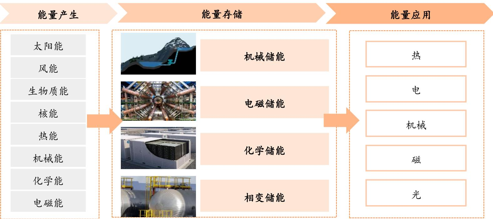  
$\textcircled { \scriptsize { 1 } }$ 各种能量的产生、储存和应用

# 1.2 储能是推动可再生能源大规模应用的关键技术

储能是推动可再生能源大规模应用的关键技术。风能和太阳能存在间歇性和波动性等固有特性，其出力特性与用电负荷无法完全匹配，且调度存在困难。因此，风电、光伏等间歇性可再生能源的大规模并网，存在影响电能质量、干扰电网稳定性、利用效率不高等问题。储能设备可以起到平抑新能源波动、跟踪计划出力、参与系统调峰调频、提高消纳水平等作用，推动可再生能源的大规模应用。

·发改委《关于促进储能技术与产业发展的指导意见》明确指出，储能能够显著提高风、光等可再生能源的消纳水平，支撑分布式电力及微网，是推动主体能源由化石能源向可再生能源更替的关键技术。

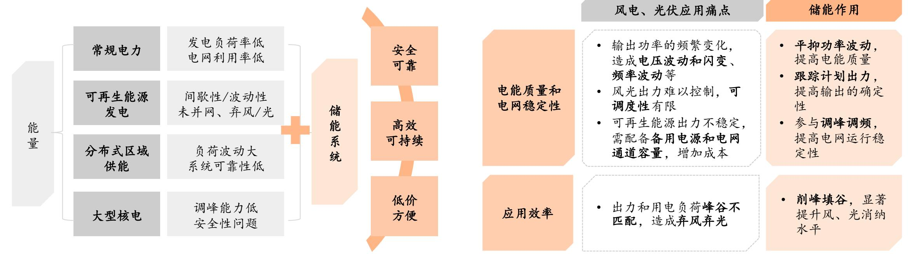  
$\cdot$ 储能在电力系统中的重要性  
储能可有效解决风电光伏规模应用的痛点  
资料来源：《储能技术及应用》中国化工学会储能工程专业委员会，平安证券研究所

电力系统由发电、输电、变电、配电、用电等环节构成，储能可用于电力系统的各个环节。

电源、电网侧（大储）：安装于电源侧、电网侧的储能系统装机规模较大，通常称为大储。大储可以实现调峰、调频、备用容量、平滑出力、缓解电网阻塞等功能，从而提升电力系统灵活性，提高新能源电能质量和消纳水平。

用户侧（户储工商储）：包括居民、工商业等用电方，配置储能（可结合分布式光伏配置）可节约用电成本、保障用电稳定。

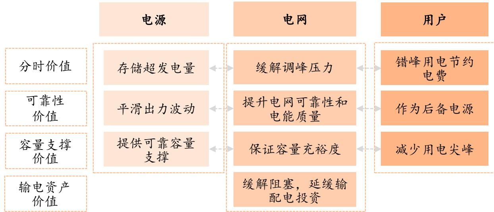  
$\textcircled { \scriptsize { 1 } }$ 储能为电力系统各参与者提供价值  
资料来源：国家能源互联网产业及技术创新联盟，派能科技招股说明书，平安证券研究所

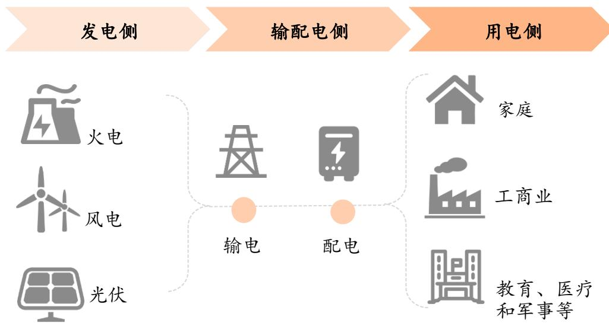  
$\cdot$ 储能应用场景及用途

缓解电网阻塞延缓输配电扩容升级

电力调峰  
辅助动态运行  
系统调频  
可再生能源并网

电力自发自用峰谷价差套利容量电费管理提升供电可靠性

概念：存储电能的设备，电力系统的“蓄水池”

二、逻辑：需求空间广阔，政策+市场驱动三、储能技术路线及装机现状四、投资建议及风险提示

# .1 现状：“双碳”目标推动下，我国风光装机占比快速增长

国内风电、光伏发电装机占比持续提升。《中共中央国务院关于完整准确全面贯彻新发展理念做好碳达峰碳中和工作的意见》提出：实施可再生能源替代行动，大力发展风能、太阳能、生物质能、海洋能、地热能等，不断提高非化石能源消费比重；构建以新能源为主体的新型电力系统。“双碳”目标号召下，我国风光装机持续提升。2025年9月底，我国光伏和风电装机总规模分别达到11.3/5.8亿千瓦，在发电装机容量中占比分别达到 $30 \%$ 和 $16 \%$ 。风光装机占电源装机的比重达到 $46 \%$ ，较2016年的 $14 \%$ 呈现大幅提升。

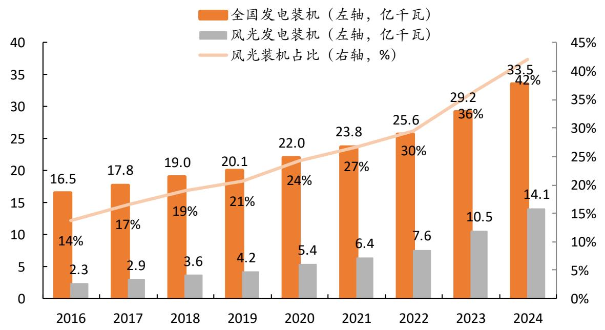  
$\diamond$ 我国发电装机规模及风光占比  
资料来源：国家能源局， $\ll 2 0 2 4$ 年度中国电力市场发展报告》，中国政府网，平安证券研究所

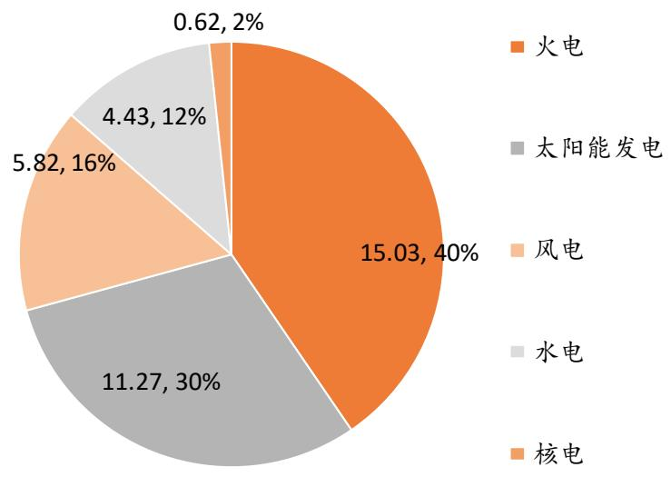  
$\textcircled { \scriptsize { 1 } }$ 我国发电装机容量结构(2025年9月底，单位：亿千瓦)

# D 现状：风光发电量占比低于装机占比，仍有进一步渗透空间

新能源发电量占比有限，装机仍有渗透空间。从发电量占比来看，2024年国内风光发电量占总发电量的比例为 $1 8 \%$ ，远低于装机量占比的 $42 \%$ 。风光发电占比低于装机量占比，主要与风电和光伏出力特性有关：光伏仅在白天发电，午间时段高发；风电的出力率则和风力大小有关，风光发电出力随气候和季节变动。《关于完整准确全面贯彻新发展理念做好碳达峰碳中和工作的意见》提出，到2030年非化石能源消费比重达到 $25 \%$ 左右，到2060年非化石能源消费比重达到 $80 \%$ 以上。考虑到新能源“大装机、小电量”的特性，新能源替代化石能源仍有广阔的渗透空间。

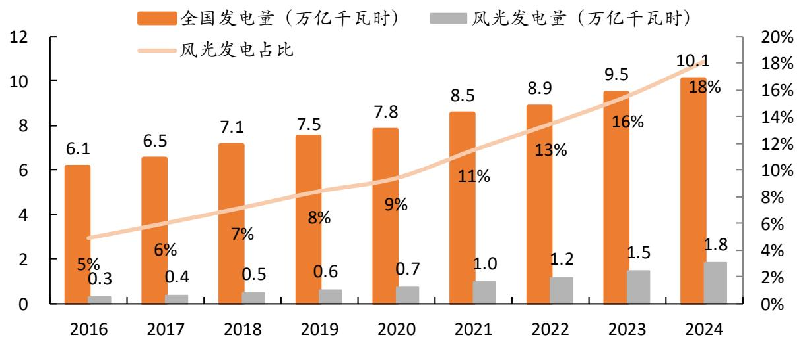  
$\textcircled { \scriptsize { 1 } }$ 我国各年度发电量及风光发电占比  
资料来源：国家能源局， $\ll 2 0 2 4$ 年度中国电力市场发展报告》，中国能建中电工程公众号，平安证券研究所

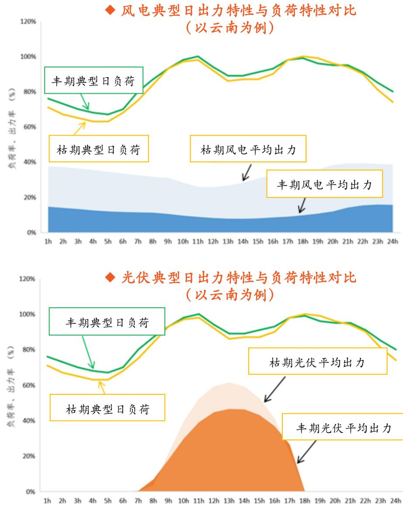

# 2.1 能源安全和双碳目标下，新能源装机及占比有望持续增长

·能源安全要求下，发展可再生能源迫在眉睫。“富煤贫油少气”是我国面临的资源禀赋现实。根据兰木达电力现货相关分析，我国煤炭/原油/天然气资源储量对应的可开采年数分别为40/40/30年；原油和天然气等资源较为依赖进口。从能源安全的角度出发，国内发展可再生能源的需求较为迫切。

大力发展新能源是“双碳”战略的内在要求。《2030年前碳达峰行动方案》指出，能源是经济社会发展的重要物质基础，也是碳排放的最主要来源；要坚持安全降碳，在保障能源安全的前提下，大力实施可再生能源替代，加快构建清洁低碳安全高效的能源体系。2021年，我国向联合国提交了到2030年的国家自主贡献目标，其中包括：到2030年，非化石能源消费比重达到 $2 5 \%$ 左右，风光装机总量12亿千瓦以上。2025年9月，我国新一轮国家自主贡献目标发布，文件提出到2035年非化石能源消费比重达到 $30 \%$ 以上，风光装机总量力争达到36亿千瓦。我国风光装机占比仍有较大提升空间。

$\diamond$ 中美俄能源资源储量及可供开采年数比较  

<table><tr><td>中国</td><td>美国</td><td>俄罗斯</td></tr><tr><td>煤炭资源储量/亿吨 2070</td><td>2500</td><td>1600</td></tr><tr><td>可供开采年数/年 40</td><td>240</td><td>470</td></tr><tr><td>原油资源储量/亿吨 78</td><td>165</td><td>235</td></tr><tr><td>可供开采年数/年 40</td><td>20</td><td>40</td></tr><tr><td>天然气储量/万亿立方米 6.6</td><td>12.6</td><td>37.4</td></tr><tr><td>可供开采年数/年 30</td><td></td><td></td></tr></table>

资料来源：兰木达电力现货，平安证券研究所

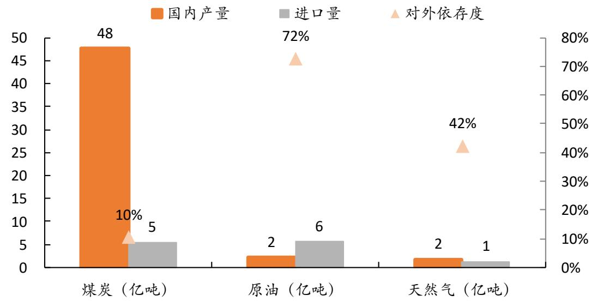  
我国化石能源对外依存度情况

# 2.2 新型电力系统，为高比例新能源装机保驾护航

高比例新能源装机对电力系统构成挑战，电力系统存在转型需求。根据《新型电力系统发展蓝皮书》，为实现“双碳”目标，在水电等传统非化石能源受站址资源约束增速放缓、核电建设逐步向新一代先进核电技术过渡的情况下，新能源应当逐步成为绿色电力供应的主力军。与此同时，新能源的快速发展对电力系统的调节能力和支撑能力提出挑战，新能源消纳形势依然严峻。

建设新型能源体系、实现“双碳”目标，需要构建新型电力系统。2021年3月15日，习近平总书记在中央财经委员会第九次会议上首次提出“构建新型电力系统”。新型电力系统以安全高效为基本前提，以高比例新能源供给消纳体系建设为主线任务，同时具备柔性灵活、智慧融合等特征。根据《新型电力系统发展蓝皮书》，新型电力系统是新型能源体系的重要组成和实现“双碳”目标的关键载体。“十五五”规划建议继续提出“加快建设新型能源体系”“积极稳妥推进和实现碳达峰”目标，构建新型电力系统仍是长期大计。

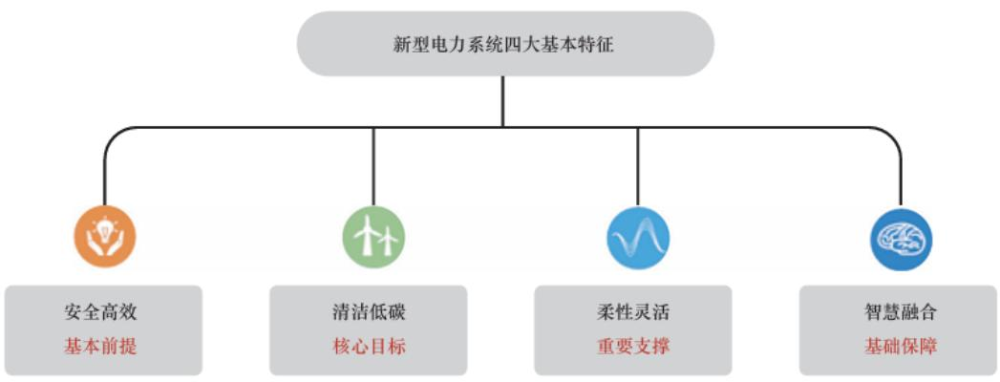  
$\diamond$ 新型电力系统四大基本特征  
资料来源：《新型电力系统发展蓝皮书》，新华网，平安证券研究所

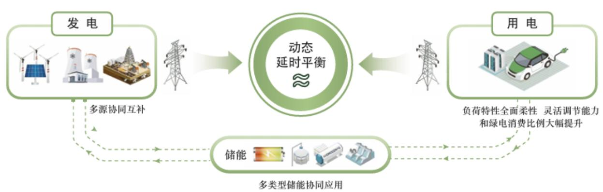  
$\cdot$ 新型电力系统图景展望

# 2.2 储能是构建新型电力系统的重要基础

# 储能是构建新型电力系统的重要基础。

《新型电力系统发展蓝皮书》提出，新形势新理念对电力系统提出新要求，系统形态由“源网荷”三要素向“源网荷储”四要素转变。储能将成为构建新型电力系统的重要组成部分。《碳达峰碳中和的中国行动》白皮书提出，储能是构建新型电力系统的重要基础。

《蓝皮书》规划了新型电力系统建设“三步走”发展路径，每个阶段对储能发展提出了不同要求：从满足日内平衡条件，到日以上时间尺度平衡调节，直到覆盖全周期的多类型储能协同运行。储能需求的量级存在广阔提升空间，技术路线也有望呈现多元发展。

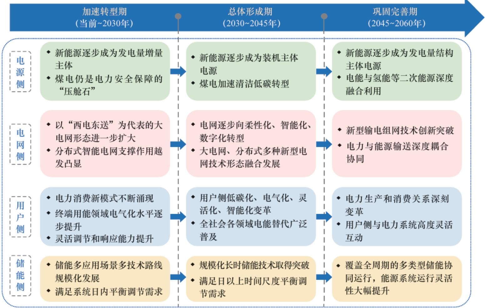  
$\cdot$ 新型电力系统建设“三步走”发展路径

# 2.2 我国新型储能装机量庞大，但量级与电力系统相比仍较小

我国新型储能装机量庞大，但量级与电力系统相比仍较小。截至2025年9月底，我国累计建成投运新型储能装机已达到1亿千瓦（100GW）以上。这一数据与“十三五”末相比增长超30倍，装机规模占全球总装机比例超过 $40 \%$ ，已跃居世界第一。但与电力系统整体规模相比，储能渗透率并不高，我们计算新型储能装机规模与发电总装机/新能源总装机之比分别仅为 $2 . 7 \%$ 和 $5 . 9 \%$ 。电量方面，2024年，国内电化学储能电站充放电总量约62TWh，占新能源发电量比例 $3 . 4 \%$ ，占发电总量的比例仅 $0 . 6 \%$ 。作为新型电力系统的重要基础，我们认为国内储能装机渗透比例仍有增长空间；同时，考虑到2035年风光装机总量36亿千瓦的装机目标（2024年底的2.6倍），我们认为国内储能装机量级仍有广阔的提升空间。

$\diamond$ 我国新型储能装机规模与发电总装机/新能源装机量对比  

<table><tr><td rowspan=1 colspan=2>2024年      2025年9月</td></tr><tr><td rowspan=1 colspan=1>全国发电装机容量（亿千瓦）</td><td rowspan=1 colspan=1>33.5                37.2</td></tr><tr><td rowspan=1 colspan=1>风电+光伏累计装机量(亿千瓦）</td><td rowspan=1 colspan=1>14.1                17.1</td></tr><tr><td rowspan=1 colspan=1>新型储能累计装机量(亿千瓦)</td><td rowspan=1 colspan=1>0.7                 1.0</td></tr><tr><td rowspan=1 colspan=1>新型储能装机功率占发电总装机比重</td><td rowspan=1 colspan=1>2.2%               2.7%</td></tr><tr><td rowspan=1 colspan=1>新型储能装机功率占新能源装机比重</td><td rowspan=1 colspan=1> 5.2%               5.9%</td></tr></table>

资料来源：国家发改委、国家能源局，国家统计局，中电联，新华网，平安证券研究所

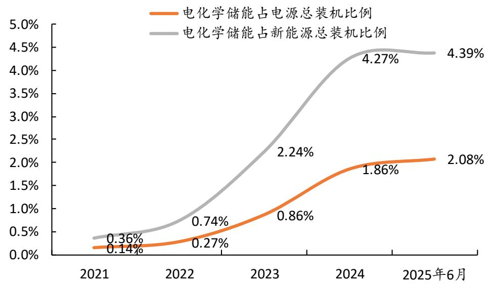  
$\diamond$ 国内电化学储能占电源总装机/新能源装机比例 (中电联口径)

$\cdot$ 电化学储能充放电量与国内发电总量/新能源发电量对比（2024年)  

<table><tr><td>项目</td><td>数值</td></tr><tr><td>国内总发电量/TWh</td><td>10087</td></tr><tr><td>新能源发电量/TWh</td><td>1836</td></tr><tr><td>电化学储能充放电总量/TWh（注2)</td><td>62</td></tr><tr><td>电化学储能充放电量占发电总量比例/%</td><td>0.6%</td></tr><tr><td>电化学储能充放电量占新能源发电量比例/%</td><td> 3.4%</td></tr></table>

注：1.右上图为中电联口径计算的比例，仅仅统计全国电力安全生产委员会企业成员投运的电化学储能电站，因此比例与左下角根据能源局数据计算结果有一定差别。2.电化学储能充放电总量：根据中电联《2024年度电化学储能电站行业统计数据》计算得

# 2.3 政策顶层设计引领，国内储能快速发展

·政策顶层设计引领下，“十四五”期间国内储能产业快速发展。“十四五”开年以来，在3060“双碳”目标引领下，我国出台了一系列政策。这些政策确立了储能产业的阶段性目标，奠定了技术方案、应用领域和参与主体“多元化”的发展基调，并通过市场机制的规划，为产业发展保驾护航。

136号文开启新篇，独立储能有望呈现高景气。2025年2月，136号文明确提出，不得将配置储能作为新建新能源项目核准、并网、上网等的前置条件；“强制配储”退出历史舞台。强配政策曾是国内大储增长的重要驱动因素，但也带来了调用率不足、低价“内卷”等情形。136号文出台后，储能成为独立的市场投资主体，与新能源建设解耦，逐步具备独立的获利方式。年内，内蒙古、甘肃等多省出台容量电价政策，助力独立储能实现经济性，储能逐渐步入市场化新阶

“十四五”以来，与我国储能产业发展相关的重要政策

# “新型储能/独立储能”登上舞台， 30GW目标打开市场空间

# 《关于加快推动新型储能发展的指导意见》

提出2025年新型储能3000万千瓦  
(30GW)以上装机目标；  
明确储能市场主体地位，助力构建商业模式。

# 《电力并网运行管理规定》《电力辅助服务管理办法》

“两个细则”出台后，储能开始作为独立市场主体登上舞台，独立储能开始成为国内大储发展的重要形式。

资料来源：中国政府网，平安证券研究所

# 新型储能“十四

# 五”纲领性文件发

《"十四五”新型储能发展实施方案》

，发展目标：2025年步入规模化发展阶段，2030年实现全面市场化发展。

市场建设：从新型储能的市场参与、成本疏导机制和商业模式创新三个方面提出目标，推动新型储能规模化发展。

# “136号文”发布，新能源强制配储退出

# 《关于深化新能源上网电价市场化改革促进新能源高质量发展的通知》

2月发布的136号文明确提出，不得将配置储能作为新建新能源项目核准、并网、上网等的前置条件；“强制配储”退出历史舞台。

# 政策支持储能规模化建设，180GW装机目标形成托底

# 《新型储能规模化建设专项行动方案》

提出到2027年全国新型储能装机规模达到1.8亿千瓦（180GW）以上。则2025-2027年年均装机不小于34GW，有望对未来三年装机规模形成托底。《方案》还提出推动新型储能利用水平提升、加快新型储能市场机制完善等目标。

# 2.3 独立储能商业模式有望逐渐跑通

独立储能商业模式有望逐渐跑通，推动大储建设投资加速。独立储能是与“新能源配储”相对的概念，指不依托于新能源电站，作为独立主体参与电力市场的储能项目。前期国内储能装机受到新能源“强配”要求驱动；随着强配政策退出，经济性成为业主建设储能电站的决定性因素。独立储能理论上可通过电能量交易、辅助服务、容量补偿等多重方式获得收益。136号文推出以来，多地推出容量电价/容量补偿政策，助力独立储能电站回收成本；与此同时，各地现货市场建设稳步推进，独立储能可通过电能量交易方式获得收益。随着政策完善和市场发展，独立储能商业模式有望逐渐理顺、实现经济性，推动储能项目投资建设加速。

# 独立储能各收益来源介绍

<table><tr><td></td><td>容量租赁</td><td>电能量交易</td><td>辅助服务</td><td>容量补偿</td></tr><tr><td>概念</td><td>·独立储能电站将部分容量出 租给新能源场站，满足其配 储需求，收取租赁费用。</td><td>利用日内电价差，通过高峰放电低 谷充电获得套利收益。 已开展电力现货市场的省份可采用 此方式获利。</td><td>·-参与辅助服务市场获取服务收 益。 ·各地储能电站可参与的辅助服务 品种各不相同，包括调峰、调</td><td>·指部分地区按容量给 予独立储能电站的补 贴。</td></tr><tr><td>详情</td><td>·独立储能市场发展以来最 重要的收益来源之一。各 地早期设定的参考价在 200 元/kWh·年上下，但是装机 规模增长使得可租赁容量 供过于求，租赁价格趋于 下降。 ·136号文取消强配，各地将 配储由“要求”改为“鼓 励”，容量租赁收益或将 逐步淡出。</td><td>·目前，国内已有山西、广东、山 东、甘肃、蒙西、湖北、浙江7地 实现了现货市场正式运行；多省已 进入连续结算试运行阶段。 储能参与现货市场的盈利空间主要 取决于峰谷价差。CNESA统计， 2025年初以来，广东、山西、山 东、甘肃现货市场峰谷价差增加， 山西达到400元/MWh以上。</td><td>频、爬坡和备用等。 ·各地开展探索，品种逐渐丰 富，收益模式逐渐完善。 ·调峰是我国独立储能市场发展 初期最主要的收益来源之一。 随着储能逐步参与现货市场， 调峰或将逐步退出。 ·调频辅助服务将成为电能量交 易之外，储能最重要的市场化 收益来源。山西、广东、甘肃 等地，调频已成为当前独立储 能最重要的收益。</td><td>截至2025年7月底已 有新疆、山东、甘 肃、内蒙古、河 北、浙江、宁夏、 青海等八个地区探 索实施了容量电价/ 容量补偿政策，对 储能按照放电量、 可用容量、装机容 量等不同标准进行 补偿。</td></tr></table>

资料来源：《中国独立储能发展报告2025》，储能与电力市场，CNESA，平安证券研究所

# 2.3 现货市场建设稳步推进，独立储能有望入市交易获利

现货市场建设稳步推进，独立储能有望入市交易获利。2025年以来，各省现货市场建设按下加速键，市场规则不断完善，试运行工作紧密开展，力争年底实现现货市场全覆盖。136号文下，强制配储和容量租赁模式淡出，现货市场价差套利将成为独立储能重要的收益来源。价差方面，CNESA统计，2025年上半年，广东、山西、山东、甘肃现货市场峰谷价差同比呈现增势；山西和蒙西峰谷价差较高，达到400元/MWh以上。随着现货市场建设稳步推进，国内更多省份的独立储能有望参与市场获利，收益模式逐渐理顺。

? 《关于全面加快电力现货市场建设工作的通知》各地时间表  

<table><tr><td>时间节点</td><td>地区</td><td>现货市场运行状态</td></tr><tr><td>2025年6月底前</td><td>广东、山西、山东、甘肃、蒙西、 湖北、省间</td><td>已转入正式运行</td></tr><tr><td rowspan="4">2025年底前</td><td>浙江 福建、 四川、辽宁、重庆、湖南、</td><td>已转入正式运行</td></tr><tr><td>宁夏、 江苏、河北南网、江西、河 南、上海、吉林、黑龙江、新疆、 蒙东、青海</td><td>启动现货市场连续结算试 运行</td></tr><tr><td>南方区域（广东、广西、云南、贵 州、海南)</td><td>已启动连续结算试运行</td></tr><tr><td>京津冀</td><td>创造条件启动模拟试运行</td></tr><tr><td>2026年6月底前</td><td>安徽、陕西</td><td>力争转入正式运行</td></tr></table>

资料来源：CNESA，平安证券研究所

截至目前（2025年11月上旬）各省区电力现货市场建设阶段  

<table><tr><td rowspan=1 colspan=2>现货市场运行状态                             地区</td></tr><tr><td rowspan=1 colspan=1>正式运行</td><td rowspan=1 colspan=1>山西、广东、山东、甘肃、蒙西、湖北、浙江、省间</td></tr><tr><td rowspan=1 colspan=1>连续结算试运行</td><td rowspan=1 colspan=1>河北南网、黑龙江、辽宁、安徽、陕西、南方区域</td></tr><tr><td rowspan=1 colspan=1>长周期结算试运行</td><td rowspan=1 colspan=1>福建、四川、江苏、湖南、宁夏、江西、上海、吉林、蒙东、青海</td></tr><tr><td rowspan=1 colspan=1>短周期结算试运行</td><td rowspan=1 colspan=1>河南、新疆</td></tr><tr><td rowspan=1 colspan=1>连续调电试运行</td><td rowspan=1 colspan=1>重庆</td></tr></table>

概念：存储电能的设备，电力系统的“蓄水池”

二、逻辑：需求空间广阔，政策+市场驱动三、储能技术路线及装机现状四 投资建议及风险提示

# 3.1 技术路线：储能技术路线百花齐放

根据储能原理划分，常见的储能技术可分为物理储能和化学储能两大类。物理储能包括机械储能、热储能和电磁储能，其原理为将电能转化为机械能、热能形式储存，或将电能以电磁能形式直接储存。化学储能包括电化学储能和氢储能，是将电能转化为化学能，用电时通过电化学反应释放电能的技术。储能不同应用场景对响应速度、充放寿命、储能时长、选址灵活性等具有不同需求，因此技术路线也百花齐放，选择较为多样。

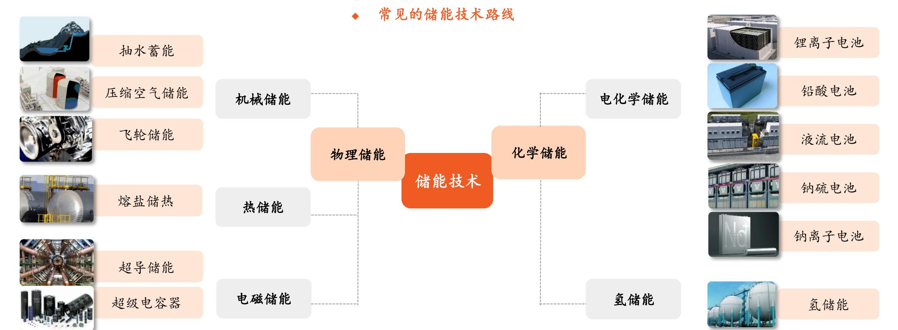

# 3.1 技术路线：储能技术路线百花齐放，锂电储能适用性最好

大型储能有多种不同技术路线，各类储能方式的功率等级和放电时间存在差异，适用电力系统的不同场景。抽蓄、液流电池和压缩空气储能规模大、理论成本低，适宜长时储能；飞轮储能、电磁储能响应速度快、循环次数高，适宜调频应用；锂离子电池规模和放电时间范围广、泛用性强、产业链成熟，是现阶段新型储能主要采用的技术方案。

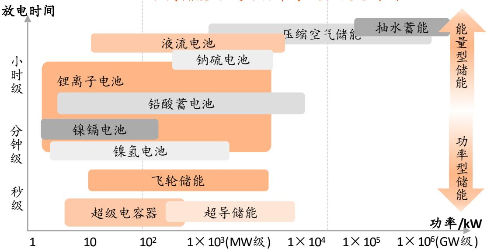  
不同储能方式的功率等级和放电时间  
资料来源：《储能原理与技术》，《功率型储能技术与应用综述》，平安证券研究所

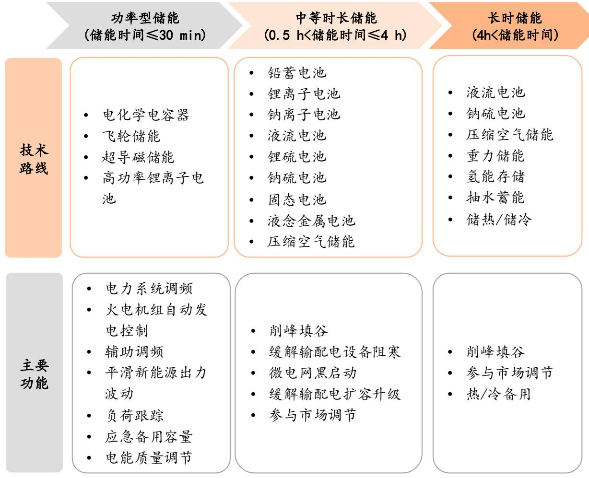  
不同时长储能的对应技术路线及主要功能

# 3.1 技术路线：锂电池储能取代抽水蓄能，成为我国电力储能主要路线

锂电池储能取代抽水蓄能，成为我国大储主要路线。新型储能通常指除抽水蓄能之外的储能技术，现阶段以锂电池储能为主。抽水蓄能单体容量庞大，曾是电力储能累计装机的主要类型。抽水蓄能的选址依赖特定地理资源，且建设周期长，增速相对有限；新型储能中的锂电池储能建设周期短、选址灵活、调节能力强，与新能源开发消纳的匹配性好，且产业链成熟，成为国内新型储能装机的主力类型。根据CNESA数据，截至2024年底，我国新型储能累计装机规模首次超过抽水蓄能，功率占比达到 $57 \%$ （其中97%是锂电池储能）；截至2025H1，国内新型储能累计装机占比已达到 $60 \%$ 。今年是“十四五”的收官之年，与“十三五”末相比，储能技术路线结构发生显著变化，抽水蓄能占比首次低于 $40 \%$ ，以锂电池为代表的新型储能实现跨越式增长，新型储能技术路线也从单一路线向多元路线化加速发展。

  
资料来源：CNESA，平安证券研究所

# 3.2 全球市场：2024年全球新型储能新增装机74GW，中、美、欧为主要市场

2024年全球新型储能新增装机74GW，中、欧、美为装机主力。根据CNESADataLink全球储能数据库的不完全统计，2024年全球新型储能新增装机规模74.1GW，同比增长 $6 2 . 5 \%$ 。2024年，中国/美国/欧洲新型储能新增装机分别占全球市场的 $5 9 \% / 1 6 \% / 1 5 \%$ ，三大主要市场占全球储能装机 $90 \%$ ，引领全球储能市场发展。我国2024年新型储能新增装机43.7GW，占据2024年全球新增装机的 $59 \%$ ，居全球首位。

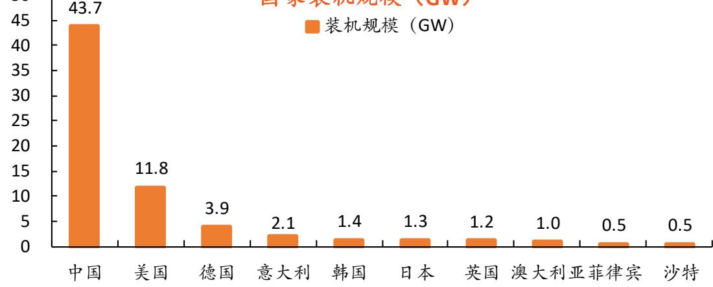  
2024年全球新型储能新增装机排名前十国家装机规模（GW)

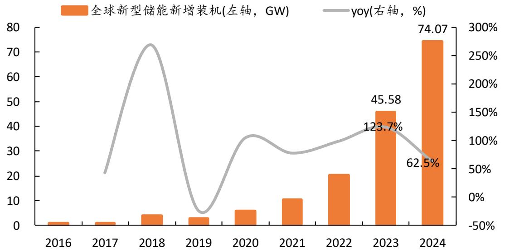  
2024年全球新型储能新增装机74.1GW  
资料来源：CNESA，平安证券研究所

  
2022-2024年全球新型储能新增装机分市场情况（单位：GW)

# 3 中国市场：2024年国内新型储能新增装机44GW，装机以大储为主

2024年，国内新型储能新增装机43.7GW/109.8GWh。根据CNESA数据，2024年，国内新增投运新型储能项目装机规模43.7GW/109.8GWh，同比增长 $1 0 3 \% / 1 3 6 \%$ ，新增装机规模首超百吉瓦时。2025年上半年，国内新增投运新型储能项目装机规模23.0GW/56.1GWh，功率规模和能量规模均同比 $+6 8 \%$ 。

国内装机形式以大储为主。2024年我国新增装机的新型储能项目中，大储占据装机增量的 $92 \%$ 。其中，独立储能和新能源配储是两大主要类型，容量占比分别为54%和 $38 \%$ 。

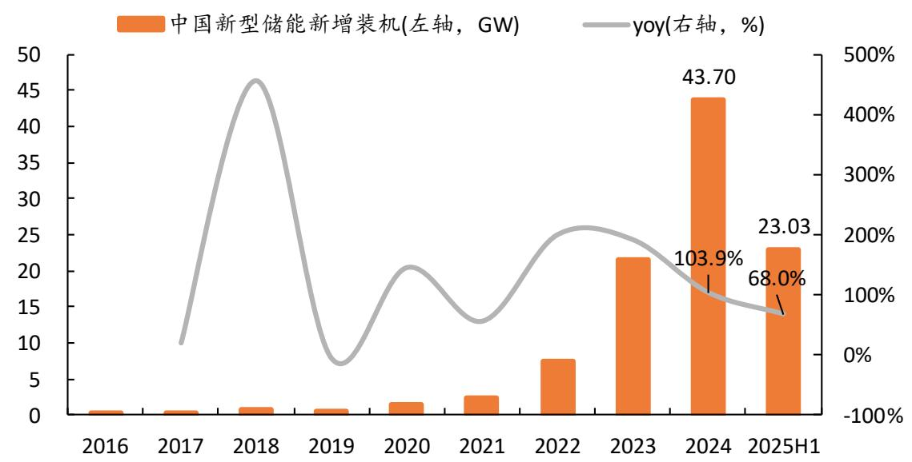  
2024年国内新型储能新增装机43.7GW  
资料来源：CNESA，储能与电力市场，平安证券研究所

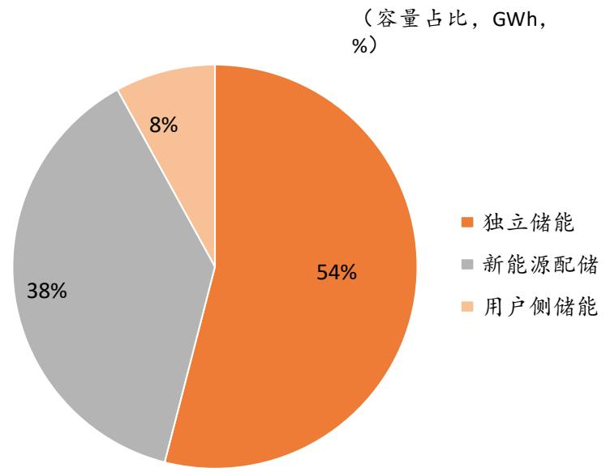  
2024年国内新型储能新增装机类型占比

，概念：存储电能的设备，电力系统的“蓄水池”

二、逻辑：需求空间广阔，政策+市场驱动三、储能技术路线及装机现状四、投资建议及风险提示

新型储能：从“配角”到“主角”，需求前景光明。新能源的快速发展对电力系统的调节能力和支撑能力提出挑战，要求电力系统形态由“源网荷”三要素向“源网荷储”四要素转变。储能登上舞台，成为构建新型电力系统的重要基础。我们认为，能源安全和双碳战略下，我国风光装机体量将持续增长；当前国内储能装机和充放电量与电力系统整体相比并不高，需求空间广阔。

、概念：存储电能的设备，电力系统的“蓄水池”。储能系统是用于电能转化和存储的装置。电的传输速度与光速相同，电力发、输、用在同一瞬间完成，要求系统实时平衡。风、光发电存在间歇性和波动性，供需难以实时匹配，高比例新能源接入会影响供电质量和用电效率。储能是电力系统中的“蓄水池”，可以动态吸收电能并适时释放，将实时平衡的“刚性”电力系统变得更加“柔性”，提高输出电能的稳定性、平滑用电负荷，从而提高供电质量和用电效率。因此，储能是推动可再生能源大规模应用的关键技术。

# . 二、逻辑：需求空间广阔，政策 $\cdot$ 市场驱动。

能源安全 $+ \infty$ 碳战略下，风光装机及占比将持续增长。截至2024年底，我国风光装机合计14亿千瓦，占电源装机量的 $42 \%$ ；2024年我国风光发电量占总发电量的 $1 8 \%$ ，远低于装机量占比。发展风光可再生能源是能源安全和双碳战略的内在需求。能源安全方面，我国三大化石能源储量可开采年数仅30-40年，且原油和天然气依赖进口，发展可再生能源的需求迫切；双碳战略方面，可再生能源替代是控制碳排放的重要途径。我国2025年9月宣布新一轮国家自主贡献目标，提出到2035年风光装机总量力争达到36亿千瓦。

新型储能渗透空间广阔，政策 $\cdot ^ { + }$ 市场驱动增长。截至2025年9月底，我国新型储能累计装机1亿千瓦以上，与“十三五”末相比增长超30倍，占全球总装机比例超过 $40 \%$ ，跃居世界第一。但与电力系统整体规模相比，储能渗透率并不高：我们计算（截至2025.9）新型储能功率与发电总装机/新能源装机之比分别为3%和6%；2024年国内电化学储能电站充放电总量约62TWh，占新能源发电量比例3.4%，占发电总量的比例仅0.6%。作为新型电力系统的重要基础，我们认为国内储能渗透率仍有增长空间；同时，考虑到2035年风光装机总量36亿千瓦的装机目标（2024年底的2.6倍），我们认为国内储能装机量级提升空间广阔。具体驱动因素来看，政策积极扶持、电力现货市场建设推进，独立储能经济性逐渐跑通，储能增长动力充足。

投资建议：风光装机总量和占比仍将持续增长，储能渗透率提升空间广阔。“十五五”规划建议提出“加快建设新型能源体系”“积极稳妥推进和实现碳达峰”目标，新型储能在新型电力系统中将扮演重要角色。我国是新型储能全球第一大市场，独立储能装机有望快速增长；与此同时，数据中心供电和电网平衡需求下，全球储能需求亦呈现高景气。推荐：海外大储领军者、全球市场竞争力强的阳光电源；国内大储市场地位领先、把握独立储能增长机遇的海博思创；海外市场拓展顺利、重视欧洲和中东新兴市场的上能电气。

风险提示：1.各市场需求增长不及预期的风险。2.全球市场竞争加剧的风险。3.市场限制政策收紧的风险。

# 1.各市场需求增长不及预期的风险。

经济性是各国储能业主装机的核心驱动因素，主要由补贴政策、市场电价等因素决定，全球储能需求可能受到国际能源供需形势、补贴政策、新能源装机等不确定性因素的影响。

# 2.全球市场竞争加剧的风险。

全球储能市场景气度高，已有较多企业试图进入。若后续市场竞争加剧，相关参与者的市场份额和盈利能力可能受到影响。

# 3.市场限制政策收紧的风险。

美欧、印巴均存在发展本土产业链的倾向，可能采用关税、市场准入限制、本土制造补贴等方式扶持本土光储产业链，相对削弱我国企业在当地市场的出口竞争力。若海外部分市场对我国企业市场限制收紧，可能影响相关公司在海外市场的业务开展。

# 平安证券综合研究所投资评级：

# 股票投资评级：

强烈推荐 (预计6个月内，股价表现强于沪深300指数20%以上)推荐 （预计6个月内，股价表现强于沪深300指数10%至20%之间)中性（预计6个月内，股价表现相对沪深300指数在± $4 0 \%$ 之间）回避 (预计6个月内，股价表现弱于沪深300指数10%以上)行业投资评级：

强于大市（预计6个月内，行业指数表现强于沪深300指数5%以上）

中性（预计6个月内，行业指数表现相对沪深300指数在±5%之间）

弱于大市（预计6个月内，行业指数表现弱于沪深300指数5%以上）

公司声明及风险提示：

负责撰写此报告的分析师（一人或多人）就本研究报告确认：本人具有中国证券业协会授予的证券投资咨询执业资格。

平安证券股份有限公司具备证券投资咨询业务资格。本公司研究报告是针对与公司签署服务协议的签约客户的专属研究产品，为该类客户进行投资决策时提供辅助和参考，双方对权利与义务均有严格约定。本公司研究报告仅提供给上述特定客户，并不面向公众发布。未经书面授权刊载或者转发的，本公司将采取维权措施追究其侵权责任。

证券市场是一个风险无时不在的市场。您在进行证券交易时存在贏利的可能，也存在亏损的风险。请您务必对此有清醒的认识，认真考虑是否进行证券交易。

# 免责条款：

此报告旨为发给平安证券股份有限公司（以下简称“平安证券”）的特定客户及其他专业人士。未经平安证券事先书面明文批准，不得更改或以任何方式传送、复印或派发此报告的材料、内容及其复印本予任何其他人。

此报告所载资料的来源及观点的出处皆被平安证券认为可靠，但平安证券不能担保其准确性或完整性，报告中的信息或所表达观点不构成所述证券买卖的出价或询价，报告内容仅供参考。平安证券不对因使用此报告的材料而引致的损失而负上任何责任，除非法律法规有明确规定。客户并不能仅依靠此报告而取代行使独立判断。

平安证券可发出其它与本报告所载资料不一致及有不同结论的报告。本报告及该等报告反映编写分析员的不同设想、见解及分析方法。报告所载资料、意见及推测仅反映分析员于发出此报告日期当日的判断，可随时更改。此报告所指的证券价格、价值及收入可跌可升。为免生疑问，此报告所载观点并不代表平安证券的立场。

平安证券在法律许可的情况下可能参与此报告所提及的发行商的投资银行业务或投资其发行的证券。平安证券股份有限公司2025版权所有。保留一切权利。